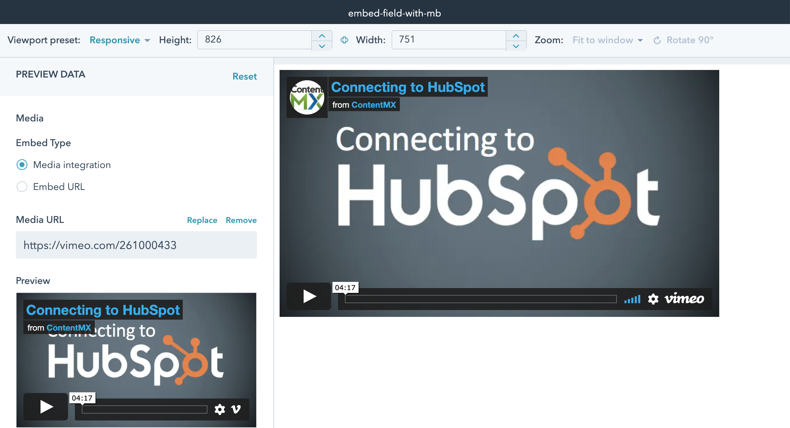
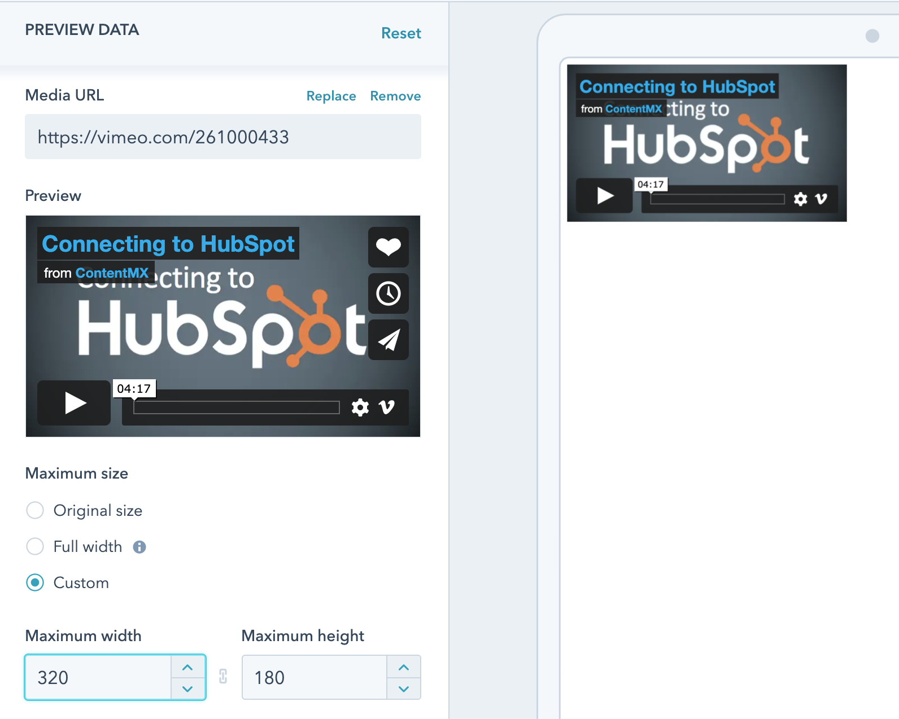

# cms-media-bridge

Examples and docs for integrating Media Bridge with the HubSpot CMS

⚠️ **This is a BETA release that uses some HubSpot features that are not available to all customer accounts. Please refer to the HubSpot [Developer Beta Terms](https://legal.hubspot.com/developerbetaterms)** ⚠️

## Modules

### Embed Field with MB  `embed-field-with-mb.module`

Example of minimal changes to [the recommended Embed field snippet](https://developers.hubspot.com/docs/cms/building-blocks/module-theme-fields/oembed#page-and-or-blog-modules) to support MB.
If any MB integrations are installed in the portal, the "Media integration" radio button will lead to the MB picker.
The JS portion has been tweaked to ignore when `data-source-type="media-bridge"`, which our helper script will take fetch and render instead, including the `?hs_utk` query param if available.
We recommend this approach for adding MB to the default video module, or when the existing styles and sizing options must be supported.



## CRM object `crm_object.module`
Uses the `crm_object` function to query for media selected in an Embed field, which allows using default and custom properties as an alternative to the oembed response.

### MB Embed - `mb-embed.module`
Renders an oEmbed player, designed for iframe-based players in Pages and Blog Posts. A custom poster image from files can be specified requiring a click to reveal the player.

### MB Email Embed (Experimental) - `mb-email-embed.module`
Renders a player fallback appropriate for email based on the oEmbed thumbnail, essentially a linked image without JS/CSS dependencies.
The image links to the oembed_url url by default, but possible to customize.
It will show a poster image based on the oembed `thumbnail_url` by default, which is possible to override with an image from Files.
When a custom poster image is selected, a play button of a specific color can be overlayed on it as well.

*Note* Currently the module must link to a HubSpot CMS page where the MB media is embedded in order to track play events.

### `media_bridge_embed` HubL Tag

Renders a player based on the MB media selected for an Embed field, and will include the `media-bridge-embed-js` helper script automatically.

```


Params:
- media_bridge_object - dict representing the media bridge object to embed, with keys id, provider_id, oembed_url, and oembed_response. this can be obtained via {{ module.field.media_bridge_object }}
- render_mode - string. `cached` and `fetched` attempt to add tracking parameters initially to prevent reloading the iframe.
  - cached (default): render cached oembed html via JS
  - refetch: fetch the oembed url every view and render via JS. 
  - eager: render cached oembed html server-side.
- poster_url - customize placeholder image (defaults to oembed thumbnail)
- placeholder_html - extra markup to be rendered inside the wrapper, can be used in a  within a  like `rich_text`. elements with `hs-mb-embed-placeholder` class will be hidden as player is revealed
- reveal_on - string. overriding does not with with `eager` render_mode
  - load (default): reveal player ASAP
  - click: reveal player when poster image/placholder_html is clicked
  - defer: do not reveal player until `hsMediaBridgeApi.revealDeferredPlayer(oembed_url)` is called
```

## Sizing options

Media Bridge integrates with the Embed field, and the `embed-field-with-mb.module` should support these options in the same way as the snippet's inline JS does.
The other modules based on the macro strive to support them with just inline styles and a bit of module CSS, but may need custom attention.



These options placed on the wrapper div in a `data-size-type` attribute.
- Original size (`size_type: auto`) - Based on the dimensions in the oEmbed response, but attempts to stay responsive
- Exact size (`size_type: exact`) - Based on the exact width and height the user providers, saved on the field as `width/height` 
- Full width (`size_type: auto_full_width`) - Fill the container responsively
- Custom - (`size_type: auto_custom_max`) - Allows the user to specify a max size while preserving the aspect ratio. Saved on the field as `max_width/max_height`

## Installation
- Make sure you're set up for [local development](https://designers.hubspot.com/tutorials/getting-started) with the [HubSpot CMS CLI](https://designers.hubspot.com/docs/developer-reference/local-development-cms-cli).
- Clone this repo and install dependencies by running `yarn install`
- To upload the modules to your HubSpot account, run `yarn upload`. The assets will be placed inside a `media-bridge/` folder in the Design Manager.
